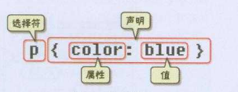

# CSS语法基础
## 基础语法
```html
<head>
    <style type="text/css">
        p{
           font-size:12px
           color:red
           font-weight:bold
        }
</style>
</head>

<body>
    <p>这是一段话</p>
</body>
```


### def
- p: 指明网页中要应用样式规则的元素，如图中选择的是p
- color: 属性
