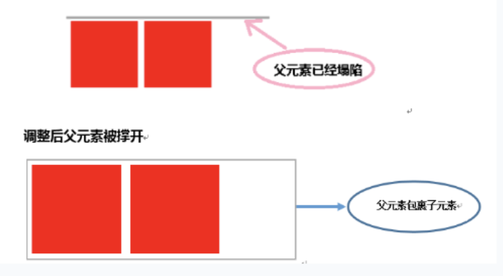

# 布局模型
## 流动模型
### def
- 默认的网页布局模式
- 块状元素都会在所处的包含元素内自上而下按顺序垂直延伸分布，在默认状态下，块状元素的宽度都为100%
- 内联元素都会在所处的包含元素内从左到右水平分布显示

## 浮动模型
### def
- 使多个块状元素可以在同一行
- 元素在默认情况下是不能浮动的，但可以用 CSS 定义为浮动，如div、p、table、img等元素都可以被定义为浮动
### 清除浮动

有时我们希望边框包裹住两个并排排列的子元素，如图所示，但将子元素设置为float父元素会坍塌，解决方法如下：
```html
<body>
    <div class="per">
        <div class="li"></div>
        <div class="li"></div>
        <div style="clear: both"></div>
    </div>
</body>
```
方法为在代表边框的父元素中添加一个空的子元素，设置`clear:both`

### demo
```html
<head>
    div{
        width:200px;
        height:200px;
        border:2px red solid;
        float:left; /* 设置块状元素在哪一侧浮动，也可以使用id标签单独设置 */
    }
</head>

<body>
    <div id="div1"></div>
    <div id="div2"></div>
</body>    

```

## 层模型
### def
类似于Photoshop的图层操作，可以对每个图层进行精确定位操作

层模式有三种形式：
### 绝对定位
#### def
- 设置position:absolute(表示绝对定位)
- 定位模式为相对于其最接近的一个具有定位属性的父包含块进行绝对定位
- 如果不存在合适的父包含块，则相对于浏览器边界定位

#### demo
```html
div{
    width:200px;
    height:200px;
    border:2px red solid;
    position:absolute;  /* 需要设置此属性 */
    left:100px;         /* 代码块位置控制关键字 */
    top:50px;
}
<div id="div1"></div>
```

### 相对定位
#### def
相对定位完成的过程是首先按static(float)方式生成一个元素(并且元素像层一样浮动了起来)，然后相对于以前的位置移动，移动的方向和幅度由left、right、top、bottom属性确定，偏移前的位置保留不动
#### demo
```html
#div1{
    width:200px;
    height:200px;
    border:2px red solid;
    position:relative;
    left:100px;
    top:50px;
} /* 代码实现位置相对以前向右移动100px，向下移动50px */

<div id="div1"></div>
```
### 固定定位
#### def
与absolute定位类型类似，但它的相对移动的坐标是视图（屏幕内的网页窗口）本身

由于视图本身是固定的，它不会随浏览器窗口的滚动条滚动而变化，除非你在屏幕中移动浏览器窗口的屏幕位置，或改变浏览器窗口的显示大小，因此固定定位的元素会始终位于浏览器窗口内视图的某个位置，不会受文档流动影响，可以想象为弹窗广告
#### demo
```html
#div1{
    width:200px;
    height:200px;
    border:2px red solid;
    position:fixed;
    left:100px;
    top:50px;
}
<p>文本文本文本文本文本文本文本文本文本文本文本文本文本文本文本文本文本文
本文本文本文本文本文本文本文本文本文本文本文本文本文本文本文本文本。</p>
```

### 绝对与相对混合定位
#### def
相对于其他元素定位

需要遵守以下规范：
- 参照定位的元素必须是相对定位元素的前辈元素
```html
<div id="box1"><!--参照定位的元素-->
    <div id="box2">相对参照元素进行定位</div><!--相对定位元素-->
</div>
```
- 参照定位的元素必须加入position:relative
```html
#box1{
    width:200px;
    height:200px;
    position:relative;        
}
```
- 被定位元素加入position:absolute，便可以使用top、bottom、left、right来进行偏移定位
```html
#box2{
    position:absolute;
    top:20px;
    left:30px;         
}
```
这样box2就可以相对于父元素box1定位了
#### demo


