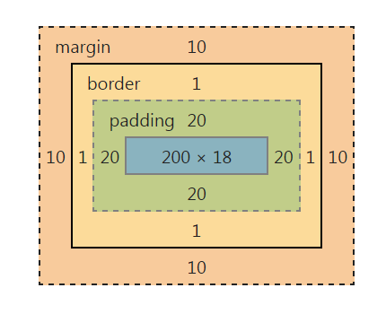

# 盒模型
## 元素分类
标签元素大体被分为三种不同的类型：块状元素、内联元素(又叫行内元素)和内联块状元素
### 块状元素
#### 种类
```html
<div>、<p>、<h1>...<h6>、<ol>、<ul>、
<dl>、<table>、<address>、<blockquote> 、<form>
```
#### 特点
- 每个块元素都独占一行
- 元素的高度、宽度、行高以及顶和底边距都可设置
- 元素宽度在不设置的情况下，是它本身父容器的100%（和父元素的宽度一致），除非设定一个宽度
- `a{display:block;}`用来将内联转化为块状元素
#### demo
```html
<style type="text/css">
    div,p{background:pink;}
    p{
        display:block;
    }
</style>
```
### 内联元素
#### 种类
```html
<a>、<span>、<br>、<i>、<em>、
<strong>、<label>、<q>、<var>、<cite>、<code>
```
#### 特点
- 和其他元素都在一行上
- 元素的高度、宽度及顶部和底部边距不可设置
- 元素的宽度就是它包含的文字或图片的宽度，不可改变
- `div{display:inline;}`
#### demo
```html
a,span,em{
	background:pink;/*设置a、span、em标签背景颜色都为粉色*/
}
```
### 内联块状元素
#### 种类
```html
、<input>
```
#### 特点
- 和其他元素都在一行上
- 元素的高度、宽度、行高以及顶和底边距都可设置
- `display:inline-block`
#### demo
```html
a{
    display:inline-block;
	width:40px;/*在默认情况下宽度不起作用*/
	height:20px;/*在默认情况下高度不起作用*/
	background:pink;/*设置背景颜色为粉色*/
	text-align:center; /*设置文本居中显示*/
}
```

## 盒模型定义
### 包含
- padding：盒子内容与盒子边框的间距（填充）
- margin：两个盒子模型的外间距
- border：盒子模型的边框
#### padding
包含（padding-top,padding-left,padding-right,padding-bottom），盒模型的高度等于 padding-top + padding-bottom + 内容

### 边框
#### def
- border-style: 边框样式, `dashed（虚线）| dotted（点线）| solid（实线）`
- border-color: 边框颜色
- border-width: 边框宽度
#### demo
```html
div{
    border-width:2px;
    border-style:solid;
    border-color:red;
}
```
```html
div{
    border-top:1px solid red;
    border-right:1px solid red; 
    border-left:1px solid red;
}
```

### 盒模型宽度
#### def


chrome元素的盒模型表示方法如下：


#### demo
```html
div{
    width:200px;
    padding:20px;
    border:1px solid red;
    margin:10px;    
}
```

### 盒模型填充
#### def
元素内容与边框之间是可以设置距离的，称之为“填充”
#### demo
- 上下左右单独设置的方法
```html
div{
   padding-top:20px;
   padding-right:10px;
   padding-bottom:15px;
   padding-left:30px;
}
div{padding:20px 10px 15px 30px;}
```
- 若上下左右间距均相同
```html
div{padding:10px;}
```
- 若上下相同，左右相同
```html
div{padding:10px 20px;}
```

### 盒模型边界
#### def
元素与其它元素之间的距离可以使用边界（margin）来设置
#### demo
- 上下左右单独设置
```html
div{
   margin-top:20px;
   margin-right:10px;
   margin-bottom:15px;
   margin-left:30px;
}
div{margin:20px 10px 15px 30px;}
```
- 上下左右间距相同
```html
div{ margin:10px;}
```
- 上下相同，左右相同
```html
div{ margin:10px 20px;}
```


